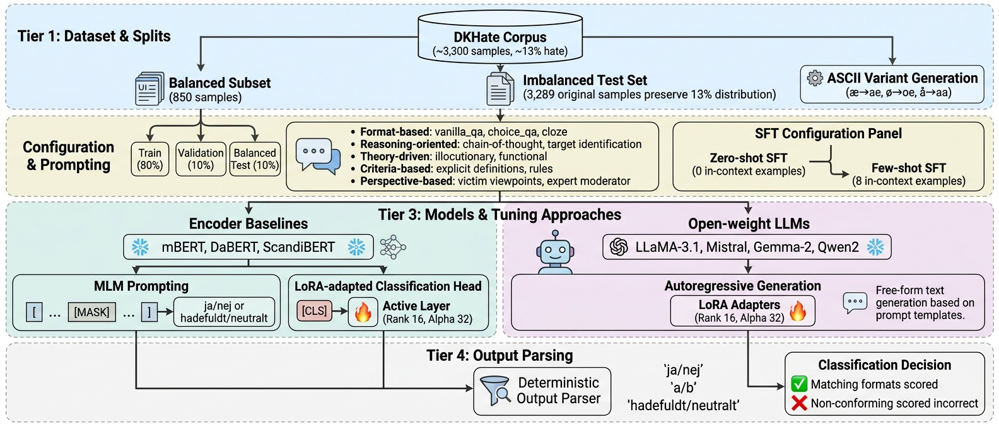

# Danish Hate Speech Detection

Danish hate speech classification using instruction-tuned LLMs and BERT models. All experiments use zero-shot instruction prompting with LoRA fine-tuning.



## Setup

```bash
git clone https://github.com/PASHAADC/Danish-LLM-HateSpeech.git
cd Danish-LLM-HateSpeech
pip install -r requirements.txt
huggingface-cli login
```

Gated models (LLaMA, Gemma) require accepting the license on huggingface.co before use.

## Models

**LLMs**:

| Key | Model |
|-----|-------|
| llama | meta-llama/Meta-Llama-3.1-8B-Instruct |
| mistral | mistralai/Mistral-7B-Instruct-v0.3 |
| gemma | google/gemma-2-9b-it |
| qwen | Qwen/Qwen2-7B-Instruct |

**BERT Models**:

| Key | Model |
|-----|-------|
| bert_multi | google-bert/bert-base-multilingual-cased |
| dabert | Maltehb/danish-bert-botxo |
| scandibert | vesteinn/ScandiBERT |

## Data Splits

Splits are pre-generated by `prepare_splits.py` to guarantee no leakage between train, validation, and test sets. Three experiment variants across two split ratios:

**80/10/10 split:**

| Variant | Train | Val | Test |
|---------|-------|-----|------|
| imbalanced | 2631 | 329 | 329 |
| balanced | 680 | 85 | 85 |
| cross_balanced | 679 | 85 | 329 (imbalanced test) |

**60/10/30 split:**

| Variant | Train | Val | Test |
|---------|-------|-----|------|
| imbalanced | 1973 | 329 | 987 |
| balanced | 509 | 86 | 255 |
| cross_balanced | 509 | 85 | 987 (imbalanced test) |

- **imbalanced**: train, val, and test split from the full dataset (3289 rows)
- **balanced**: train, val, and test split from the balanced dataset (850 rows, 50/50)
- **cross_balanced**: balanced train and val derived from the imbalanced remainder after holding out the imbalanced test set, then evaluated on the imbalanced test set. No leakage because balanced rows are drawn only from non-test data.

All splits are stratified. To regenerate:

```bash
python prepare_splits.py
```

Files are saved to `data/dk_hate_processed/splits/`.

## Prompt Patterns

11 prompt patterns, available in both zero-shot and 8-shot (few-shot) variants:

vanilla Q&A, choice Q&A, cloze, cot, target, illocutionary, functional, definition, victim perspective, expert moderator, rules based

To switch between zero-shot and few-shot, toggle which `PROMPT_PATTERNS` block is active in `src/config.py`. The few-shot templates prepend 8 balanced in-context examples (4 hate, 4 non-hate) to each prompt. BERT models use their own hardcoded zero-shot patterns in `src/finetuning/encoder_models.py` and are unaffected by this toggle.

## Running Experiments

**LLM fine-tuning:**

```bash
# 60-10-30, imbalanced, --clear-master clears previous results
python run_finetuning.py --split 60_10_30 --variant imbalanced --clear-master

# 60-10-30, balanced
python run_finetuning.py --split 60_10_30 --variant balanced

# 60-10-30, cross_balanced (balanced train, imbalanced test)
python run_finetuning.py --split 60_10_30 --variant cross_balanced

# 80-10-10, imbalanced
python run_finetuning.py --split 80_10_10 --variant imbalanced

# 80-10-10, balanced
python run_finetuning.py --split 80_10_10 --variant balanced

# 80-10-10, cross_balanced
python run_finetuning.py --split 80_10_10 --variant cross_balanced

# Specific models or patterns
python run_finetuning.py --split 60_10_30 --variant imbalanced --models llama gemma --patterns vanilla_qa cot
```

Each run trains all 4 models on all 11 patterns, evaluates on base model (no fine-tuning) and SFT model (LoRA fine-tuned) on the test set, and saves metrics and plots to `results/`.

**BERT experiments:**

```bash
# All BERT experiments for 80/10/10 (runs balanced, imbalanced, cross_balanced by default)
python -m src.finetuning.run_encoder --stage all --split 80_10_10

# All BERT experiments for 60/10/30
python -m src.finetuning.run_encoder --stage all --split 60_10_30

# Only specific variants
python -m src.finetuning.run_encoder --stage all --split 80_10_10 --variant balanced imbalanced

# MLM prompting only
python -m src.finetuning.run_encoder --stage mlm --split 80_10_10

# Classification head only
python -m src.finetuning.run_encoder --stage cls --split 60_10_30

# Specific models
python -m src.finetuning.run_encoder --stage all --split 80_10_10 --models bert_multi dabert

# Print results summary
python -m src.finetuning.run_encoder --stage summary
```

The BERT pipeline automatically resumes: completed experiments are skipped based on `encoder_results.csv`. When `--variant` is omitted, all three variants (balanced, imbalanced, cross_balanced) are run.

**LLM few-shot:**

Ensure the few-shot `PROMPT_PATTERNS` block is active in `src/config.py` (zero-shot commented out), then run:

```bash
python run_finetuning.py --split 80_10_10 --variant imbalanced --clear-master
python run_finetuning.py --split 60_10_30 --variant imbalanced
```

